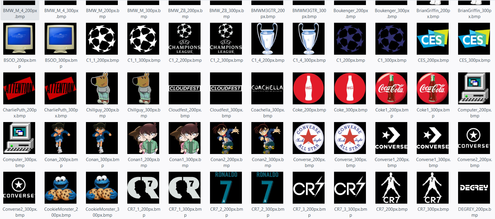

<!-- PROJECT LOGO -->
<br />
<div align="center">
  <a>
    
  </a>
  
  <h3 align="center">Win10BootLogoCollection</h3>
  <p align="center">
    My collection of custom boot logos designed for Windows 10
  </p>
</div>


<!-- ABOUT THE PROJECT -->
## About The Project

I made this collection of custom boot logos specifically for users who want to change their Windows 10 boot logo using [HackBGRT](https://github.com/Metabolix/HackBGRT). To accommodate different preferences and display requirements, the logos are available in two sizes: 200x200 pixels and 300x300 pixels. I made this for people who don't know how to use Photoshop


<!-- GETTING STARTED -->
### Installation

_A. IMPORTANT NOTES._

1. Your computer's BIOS mode **HAS TO BE** UEFI mode, NOT Legacy mode. 
You can check by pressing Windows + R keys together to launch the Run box. Type MSInfo32 and hit Enter. System Information window will open. Click on the System Summary item
<p align="center">
  <a>
    
  </a>
</p>

2. Secure Boot **HAS TO BE DISABLED**
<p align="center">
  <a>
    
  </a>
</p>

3. Bitlocker **MUST ALSO BE DISABLED** (https://github.com/Metabolix/HackBGRT/issues/28)  
<p align="center">
  <a>
    
  </a>
</p>

4. Download the latest version of HackBGRT.

_B. INSTALLATION._

1. Clone the repo
  ```sh
  git clone https://github.com/MnTrinfs/Win10BootLogoCollection.git
  ```
2. Choose your favourite logo. Rename it: `splash.bmp` (Remember its size has to be from 200x200px to 300x300px). Then copy & paste it to the HackBGRT folder
<p align="center">
  <a>
    
    
  </a>
</p>

3. Run HackBGRT (setup.exe) as admin. A CMD window will open
<p align="center">
  <a>
    
    
  </a>
</p>

4. Simply press I to install. A paint window displaying the logo will open—just close it and don’t take any further action.
<p align="center">
  <a>
    
  </a>
</p>

5. Just let it install, and you're all set. Enjoy!
<p align="center">
  <a>
    
  </a>
</p>

<!-- TROUBLESHOOTING -->
## Troubleshooting

_For more examples, please refer to the [Documentation](https://github.com/Metabolix/HackBGRT?tab=readme-ov-file#troubleshooting)_
